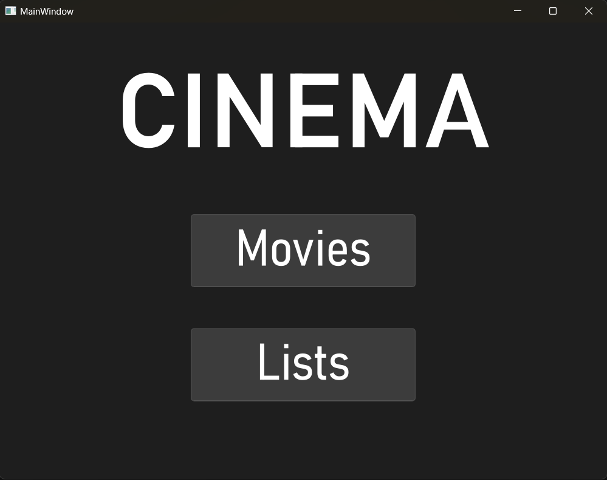
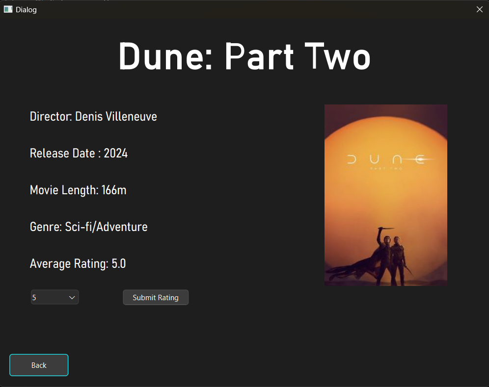
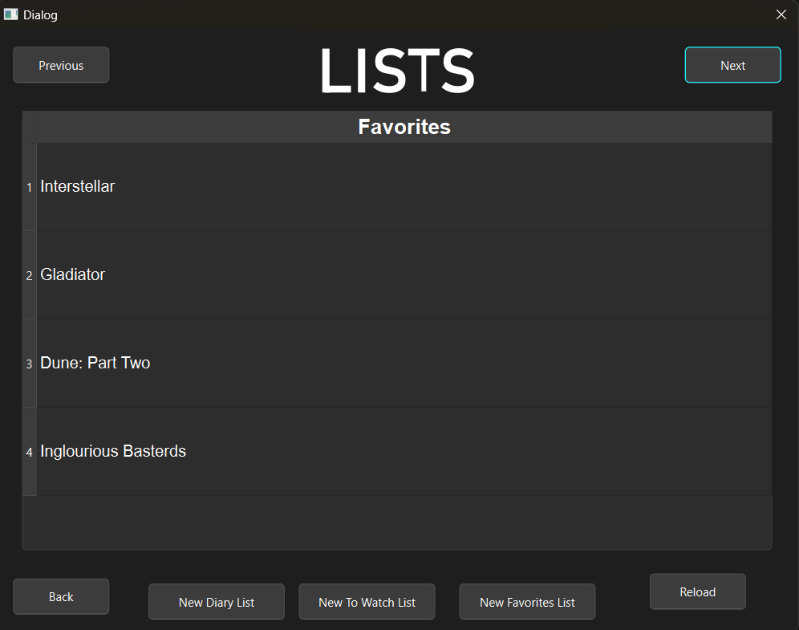

# 🎬 Cinema Movie App

**Cinema** is a simple desktop movie application built with **C++ and Qt**. It allows users to search for movies, view details, rate them from 0 to 5 stars, and organize them into custom lists. The app is structured for easy navigation and uses CSV files to store data such as movie info, ratings, and personal lists.
<p align="center">
  
</p>

---

## ✨ Features

### 🎥 Movie Section
<p align="center">
  
</p>

* **Search Window**:
  Browse and search for movies by title.

* **Movie Details Window**:
  View detailed information about a selected movie and add a personal rating. Ratings are averaged across users and updated in real-time.

---

### 🗂️ Lists Section
<p align="center">
  
</p>

* View all available lists (including those created by other users).
* Create three types of personal lists:

  * ⭐ Favorites List
  * 📽️ To-Watch List
  * 📔 Diary List

Each list can include any movie in the database. Users can search and add movies while creating a new list. Lists are saved and displayed automatically.

---

## 💾 Data Storage

All application data is stored in CSV files:

| File Name        | Purpose                                |
| ---------------- | -------------------------------------- |
| `MoviesInfo.csv` | Static movie data (title, genre, etc.) |
| `Ratings.csv`    | Stores user-submitted ratings          |
| `List.csv`       | Contains user-created lists            |

> Note: Movie data is static; users cannot add new movies from the UI (only by editing the CSV manually).

---

## 🏗️ Architecture & Design

The app follows basic **Object-Oriented Design (OOD)** principles:

* **Encapsulation**: Each window or component handles a single task.
* **Single Responsibility Principle**: Each class manages one part of the system (e.g., movie loading, list creation).
* **Open/Closed Principle**: Easily extendable to add new list types or features.

### 🧩 Design Patterns Used:

* **Factory Pattern**: For creating different list types.
* **Builder Pattern**: For constructing movie objects with many attributes.
* **Proxy Pattern**: To defer image loading and improve performance.

---

## 🚀 How to Run

### Option 1: Run Executable

1. Download the project from GitHub.
2. Open the `Executable/` folder.
3. Run `Cinema.exe` to launch the app.

### Option 2: Compile from Source

1. Open the project in **Qt Creator**.
2. Open the `.pro` file inside the `Code/` folder.
3. Build and run the project using Qt Creator’s tools.

> All code files (`.cpp`, `.h`, `.ui`), assets, and CSV data are located in the `Code/` folder.

---

## 📁 File Structure

```
/Cinema
├── Code/
│   ├── *.cpp / *.h / *.ui        # Source and UI files
│   ├── *.jpg                     # Movie poster images
│   ├── MoviesInfo.csv            # Static movie database
│   ├── Ratings.csv               # User ratings
│   └── List.csv                  # User-created lists
├── Executable/
│   └── Cinema.exe                # Precompiled app (Windows)
```
---
## 🐞 Known Issues

* **App Keeps Running in Background**:
  If you close the application while you're on a page **other than the main window**, the app may **continue running in the background**.
  To fix this:

  1. Open **Task Manager**.
  2. Locate `Cinema.exe` under the **Processes** tab.
  3. Click **End Task** to fully close the application.

* **Static Movie Database**:
  Currently, new movies cannot be added through the UI. Users must manually edit the `MoviesInfo.csv` file to add entries. This is planned for improvement in future updates.

---

## 🔒 License

**Copyright © 2025**
Samuel Angarita

All rights reserved.

This project and its source code are protected by copyright and may **not** be copied, modified, distributed, published, or used for commercial purposes without **explicit written permission** from the authors.

> Unauthorized use, reproduction, or sale of this app,  including any of its code, assets, or design,  is strictly prohibited and may result in legal action.

If you are interested in using this project for educational, showcase, or collaborative purposes, please contact the authors directly.

---


